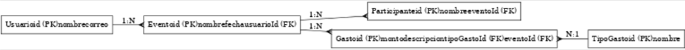

This is a [Next.js](https://nextjs.org/) project bootstrapped with [`create-next-app`](https://github.com/vercel/next.js/tree/canary/packages/create-next-app).

# Estructura de carpetas
```
project-root/
├── prisma/                     # Archivos relacionados con Prisma
│   ├── schema.prisma           # Esquema de la base de datos
│   └── migrations/             # Migraciones de la base de datos
├── public/                     # Archivos estáticos accesibles públicamente
│   └── assets/                 # Imágenes y otros recursos
├── src/
│   ├── app/                    # App Router de Next.js (páginas y API)
│   │   ├── (auth)/                # Páginas del frontend que se muestran si el usuario está registrado
│   │   │   ├── admin/
│   │   │   │   ├── page.tsx
│   │   │   ├── dashboard/
│   │   │   │   ├── page.tsx
│   │   │   ├── eventos/        # Páginas relacionadas con eventos
│   │   │   │   ├── page.tsx
|   │   │   │   └── nuevo/
│   |   │   │       ├── page.tsx    # Subruta para agregar un nuevo evento
│   │   │   ├── gastos/         # Páginas relacionadas con gastos
│   │   │   │   ├── page.tsx    # Página principal para ver gastos
|   │   │   │   └── nuevo/
│   |   │   │       ├── page.tsx    # Subruta para agregar un nuevo gasto
│   │   │   ├── layout.tsx
│   │   │   ├── middlewares.ts
│   │   ├── api/                # Rutas del backend (microservicios)
│   │   │   ├── auth/
│   │   │   │   ├── [...nextauth]
│   │   │   |   │   ├── route.ts  # Configuration autentication file with Google
│   │   │   ├── gastos/
│   │   │   │   ├── route.ts    # Endpoint de gestión de gastos
│   │   │   └── eventos/
│   │   │       ├── route.ts    # Endpoint de gestión de eventos
│   │   ├── login/              # ruta para hacer el login / register
│   │   │   ├── loginPage.tsx   # Página para hacer el login / register
│   │   └── global.css          # CSS
│   │   └── layout.tsx          # Layout principal de la aplicación
│   │   └── page.tsx            # pagina principal de la aplicación
│   │   └── provider.tsx        # el provider de next-auth
│   ├── services/               # Lógica del backend (controladores, servicios)
│   │   ├── gastos/
│   │   │   ├── gastos.controller.ts
│   │   │   ├── gastos.service.ts
│   │   ├── eventos/
│   │       ├── eventos.controller.ts
│   │       ├── eventos.service.ts
│   ├── config/                 # Configuración general
│   │   ├── database.ts         # Configuración de Prisma (cliente)
│   │   └── env.ts              # Variables de entorno
│   ├── components/             # Componentes reutilizables de la UI
│   │   ├── button.tsx          # boton de login / logout
│   │   ├── navBar.tsx          # navbar
│   │   ├── Header.tsx          # Encabezado común de la aplicación
│   │   ├── Footer.tsx          # Pie de página
│   │   ├── GastoForm.tsx       # Formulario para agregar gastos
│   ├── middlewares/            # Middlewares globales del backend
│   │   └── errorHandler.ts     # Middleware para manejo de errores
│   ├── styles/                 # Estilos globales y variables CSS
│   │   ├── globals.css         # Estilos globales
│   │   └── variables.css       # Variables CSS (colores, tipografía)
│   ├── utils/                  # Utilidades compartidas
│   │   ├── formatDate.ts       # Formato de fechas
│   │   └── logger.ts           # Logger genérico
│   └── lib/                    # Código compartido entre backend y frontend
│       └── prisma.ts           # Inicialización del cliente Prisma
├── .env                        # Variables de entorno
├── tsconfig.json               # Configuración de TypeScript
├── next.config.js              # Configuración de Next.js
├── package.json                # Dependencias y scripts
└── README.md                   # Documentación del proyecto
```
# Diagrama entidad relación de la base de datos

Hacerlo con una herramienta más piola

